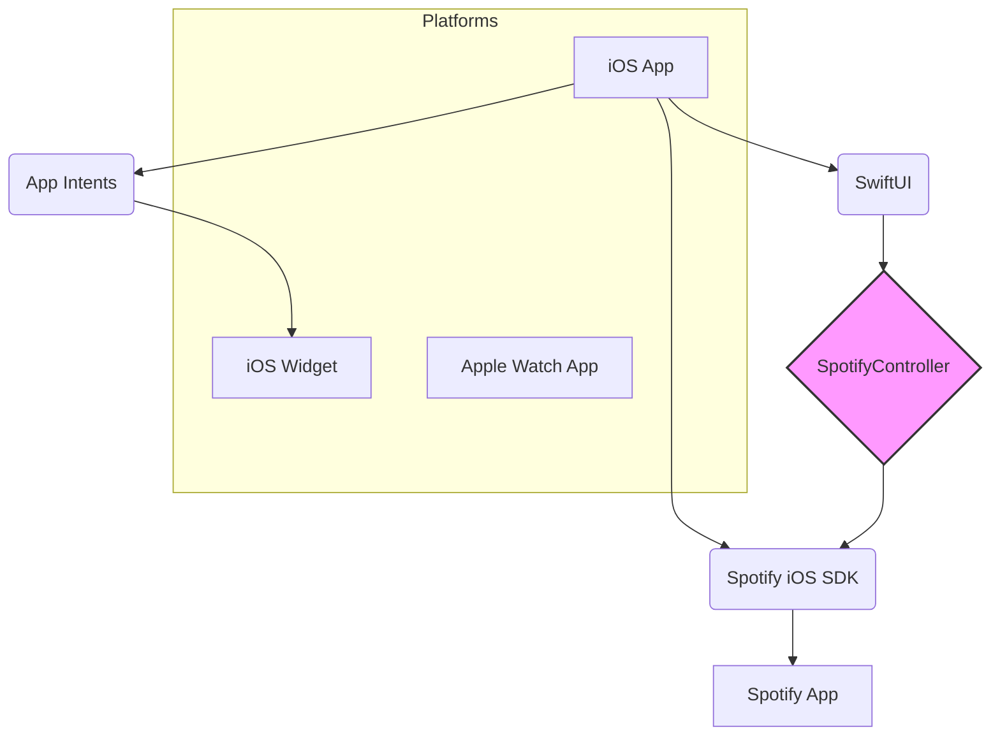

# NowPlaying

NowPlaying is a sleek and modern iOS application designed for music enthusiasts who want a beautiful, "glassmorphism" interface to control and view their currently playing Spotify tracks. It leverages the official Spotify iOS SDK to provide real-time playback information and interactive controls directly from the app and its companion widget.

## Features

*   **Real-time Playback Info:** Displays track name, artist, and high-quality album art directly from your active Spotify session.
*   **Interactive Playback Control:** Play, pause, skip next/previous, and toggle shuffle/repeat modes.
*   **Waypoint System:** Bookmark specific moments in any song with "Waypoints." Add, remove, and jump to waypoints instantly using a dedicated dock or by tapping markers on the progress bar.
*   **Customizable "Glassmorphism" UI:** 
    *   **Dynamic Backgrounds:** Choose between Light, Dark, or a dynamic "Album Art" theme that blurs the current track's artwork.
    *   **Blur Control:** Fine-tune the background blur radius to your preference.
    *   **Ultra-thin Materials:** A sophisticated translucent interface that feels modern and integrated.
*   **Interactive iOS Widget:** Control your music directly from your home screen with a beautiful widget that supports play/pause and skipping.
*   **Spotify Integration:** Log in with your Spotify account to see your profile details and sync playback across devices.
*   **Configurable Skip Intervals:** Customize forward/backward skip durations (5s, 10s, 15s, or 30s).
*   **Apple Watch Companion:** (In development) A companion app for your Apple Watch to control playback on the go.

## Tech Stack

The application is built with modern Apple technologies and the official Spotify SDK.



*   **SwiftUI:** Powering the entire responsive and fluid user interface.
*   **Spotify iOS SDK:** Handles authorization, playback synchronization, and track metadata.
*   **App Intents:** Enables interactive widget functionality, allowing for seamless playback control outside the main app.
*   **Combine Framework:** Manages asynchronous data flow between the `SpotifyController` and the UI.
*   **UserDefaults:** Provides persistent storage for user preferences and track waypoints.

## Project Structure

```
NowPlaying/
└── frontend/             # iOS/watchOS app sources (Xcode project root)
    ├── Now Playing/      # Main iOS Application Target
    │   ├── ContentView.swift # Main Glassmorphism UI
    │   ├── SpotifyController.swift # Core Spotify logic
    │   ├── Waypoint.swift    # Waypoint data model
    │   ├── AuthorizationView.swift # Spotify login UI
    │   └── PlaybackState.swift # Shared playback models
    ├── iOS Widget/       # Interactive Widget Target
    │   ├── iOS_Widget.swift  # Widget UI
    │   └── PlaybackControlIntents.swift # App Intents
    └── watchOS Watch App/ # watchOS App Target (Development)
        └── ...
```

## Getting Started

### Prerequisites
*   A Spotify Premium account (required by the Spotify SDK for playback control).
*   The Spotify app installed and logged in on your physical device or simulator.
*   Xcode 15.0 or later.

### Setup
1.  **Clone the repository:**
    ```bash
    git clone https://github.com/your-username/NowPlaying.git
    cd NowPlaying
    ```
2.  **Spotify Developer Dashboard Setup:**
    *   Go to the [Spotify Developer Dashboard](https://developer.spotify.com/dashboard).
    *   Create a new app.
    *   Copy your `Client ID`.
    *   In "Edit Settings", add `spotify-ios-quick-start://spotify-login-callback` to the **Redirect URIs**.
3.  **Configuration:**
    *   Create a file named `Sample.xcconfig` in `frontend/Now Playing/`.
    *   Add your client ID:
        ```
        SPOTIFY_API_CLIENT_ID = YOUR_CLIENT_ID
        ```
    *   In Xcode, ensure the "URL Types" in the "Now Playing" target's Info tab matches your redirect URI scheme (e.g., `spotify-ios-quick-start`).

### Running the App
1.  Open `frontend/Now Playing.xcodeproj` in Xcode.
2.  Select the **Now Playing** scheme.
3.  Run on a physical iOS device or a simulator with Spotify installed.
4.  Tap "Connect to Spotify" and authorize the application.

**Note:** For the widget to update correctly, ensure you have enabled Background App Refresh for NowPlaying.
